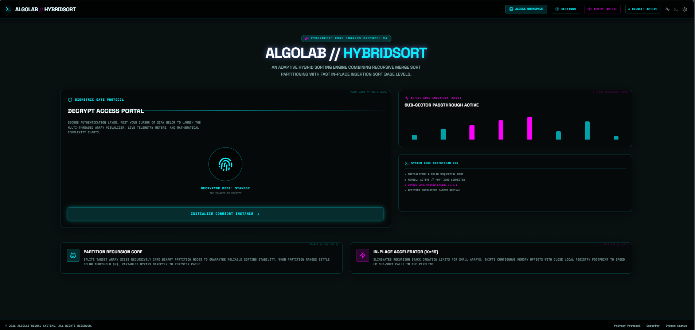
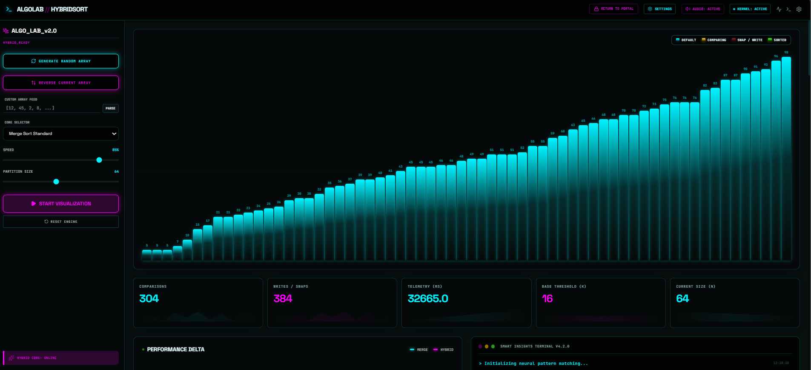
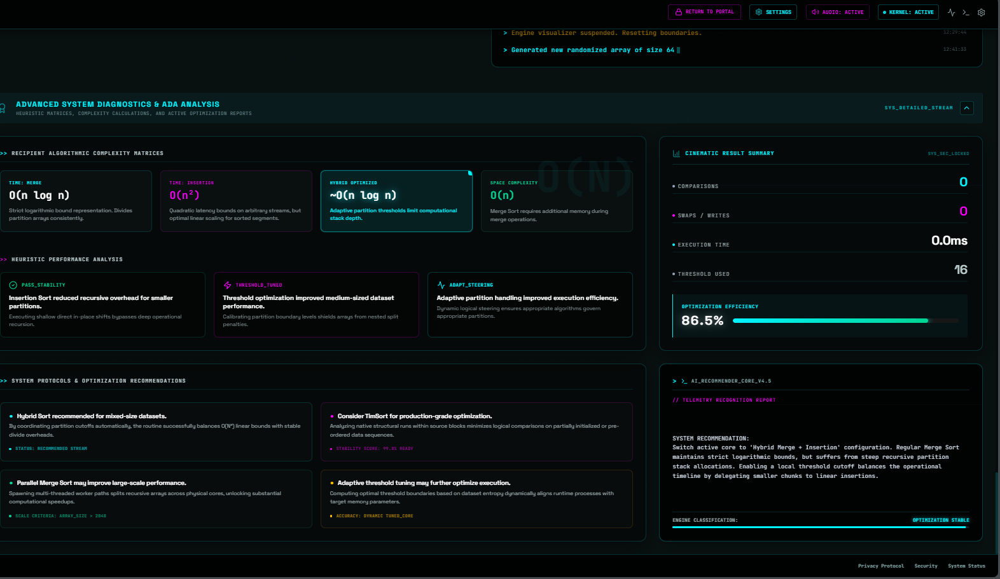

# ⚡ ALGOLAB

### Hybrid Merge + Insertion Sort Visualizer

A futuristic ADA micro-project that visualizes the working of a Hybrid Merge + Insertion Sort algorithm using real-time animations and analytics.

---

# 🚀 Features

* Real-time sorting visualization
* Hybrid Merge + Insertion Sort
* Live analytics dashboard
* Time complexity analysis
* Performance comparison
* Modern futuristic UI
* Responsive dashboard
* Interactive controls

---

# 🧮 Algorithms Used

## Merge Sort

* Time Complexity: `O(n log n)`

## Insertion Sort

* Best for smaller partitions
* Best Case: `O(n)`

## Hybrid Sort

Combines Merge Sort and Insertion Sort for optimized performance.

---

# 🛠️ Tech Stack

* React
* TypeScript
* Vite
* Tailwind CSS
* JavaScript

---

# 📸 Screenshots

## 🌌 Landing Page



---

## ⚡ Visualization Dashboard



---

## 📊 Analytics System



---

# ▶️ Run Locally

```bash
npm install
npm run dev
```

---

# 👨‍💻 Developed By

**Shrivathsa**
SVIT Engineering

---

# 📌 Project Type

ADA Micro Project – Hybrid Algorithm Visualization System
